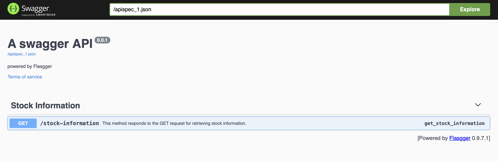

# NSE DATA


This API allows users to retrieve information about a stock using its ticker symbol.

## Base URL

The base URL for this API is `https://stocks2.onrender.com/apidocs/`

## Endpoints

### Retrieve Stock Information

- **URL:** `/stock-information`
- **Method:** `GET`
- **Description:** Retrieves information about a specified stock using its ticker symbol.
- **Query Parameters:**
  - `ticker` (required): The stock symbol (ticker) for which information is requested.
- **Responses:**
  - `200 OK`: Successful response containing information about the specified stock.
  - `400 Bad Request`: Indicates that the provided stock symbol is invalid or not found.
  - `500 Internal Server Error`: Indicates an issue with retrieving stock information.

### Example

**Response:**
```json
{
  "information": {
    "52WeekChange": 0.068573594,
    "SandP52WeekChange": 0.25222528,
    "address1": "Plot No. 44/97 A",
    "address2": "3rd cross Electronic City Hosur Road",
    "auditRisk": 6,
    "averageDailyVolume10Day": 4619790,
    "averageVolume": 6395338,
    "averageVolume10days": 4619790,
    "beta": 0.565,
    "boardRisk": 2,
    "bookValue": 2.323,
    "city": "Bengaluru"
  }
}


